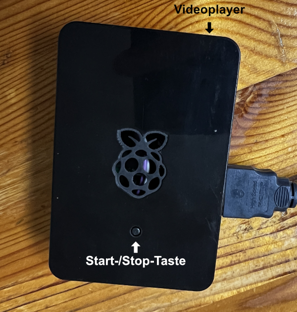

# Videoplayer

**Stand-alone Videoplayer mit Raspberry Pi**

## Motivation

Während einer Ausstellung in einer Galerie sollte ein Video präsentiert werden. Ein Beamer war vorhanden, aber ein Laptop fehlte. Dazu kam, dass ein Laptop oder PC viel Platz wegnimmt, die Gefahr besteht, dass er entwendet wird und zum Starten eines Videos das Aufsichtspersonal wissen muss, wie PC und Video gestartet wird.

Das brachte mich auf die Idee, einen Player auf Basis eines Raspberry Pi aufzubauen. Das Ziel war, dass das Video sofort nach dem Starten des Raspberries in einer Schleife losläuft. Eine Tastatur oder Maus zur Bedienung soll nicht notwendig sein.

Um das Video abzuspielen gibt es zwei Softwarepakete: `omxplayer` und `VLC`. Der `omxplayer` setzt auf einer abgekündigten Schnittstelle des Raspbian Betriebssystems auf. Um zukunftsfähig zu sein, hatte ich mich zunächst für deb `VLC`-Player entschieden, dann aber festgestellt, dass die Konfiguration kompliziert ist und der Player nicht unter dem `root`-Nutzer läuft, was aber notwendig ist, um den Player als Dienst zu starten. Die Lösung war dann der `omxplayer` unter der älteren Raspbian-Version.

Player | Vorteile | Nachteile
---|---|---
`omxplayer` | <li>Läuft unter `root`<li>wenig Konfigurationsaufwand<li>sehr Ressourcenschonen, da ARM Hardwarebeschleunigung genutzt wiird<li>für die Nutzung auf der Kommandozeile gedacht | <li>für neuere Raspian-Versionen ungeeignet, da benutztes Interfache 'openvg' abgekündigt<li>letzter GIT-Commit im September 2019
`VLC`| <li>läuft auch auf aktuellen Betriebssystemversionen<li>ständige Weiterentwicklung | <li>aufwändige Konfiguration in `/boot/config.txt`<li>ist eigentlich für Desktop-Nutzung gedacht<li>Einstellungen der Videopuffer notwendig, damit das Video ohne Unterbrechungen wiederholt wird<li>läuft nicht unter `root`-Rechten, deswegen für einen System-Service ungeeignet<li>Autostart nur über Desktop möglich

Letztendlich habe ich mich für den `omxplayer`entschieden.

## Funktionsweise
Das Abspielen des Videos ist als Systemdienst installiert. Dadurch läuft das Video sofort los, wenn der Raspberry gestartet wird. Die Videodatei kann entweder in einem Verzeichnis `/home/pi/media` auf der SD-Karte liegen, oder auf einem eingesteckten USB-Stick. Zur Nutzung des USB-Sticks ist das Tool `usbmount` notwendig, welches einen automatischen Mount des Laufwerks unter Raspbian vornimmt. In einer Konfigurationsdatei `play.txt` können noch Betriebsoptionen mitgegeben werden. **Achtung:** es wird immer nur <ins>eine</ins>, die alphabetisch erste, Videodatei abgespielt und es werden nur `.mp4`-Dateien abgespielt.

### Einfaches Abspielen vom USB-Stick (Schleife)
1.  Videodatei auf Stick kopieren. Name ist egal, Dateiendung muss `.mp4` sein.
1.  Raspberry einschalten

### Einmaliges Abspielen vom USB-Stick
1.  Videodatei auf Stick kopieren. Name ist egal, Dateiendung muss `.mp4` sein.
1.  Eine Datei `play.txt` auf dem Stick anlegen, die das Wort `once` enthält.
1.  Raspberry einschalten

### Abspielen von der internen SD-Karte
1.  Videodatei auf Stick kopieren. Name ist egal, Dateiendung muss `.mp4` sein.
1.  Eine Datei `play.txt` auf dem Stick anlegen, die das Wort `copy` enthält.
1.  Raspberry einschalten
1.  Vor dem Abspielen werden die Dateien vom Stick auf die SD-Karte kopiert und anschließend von dort abgespielt.
1.  Anschließend kann der USB-Stick entfernt werden.

*Da das Verzeichnis auf der SD-Karte vor dem Kopieren gelöscht wird, ist es so auch möglich, das Video, welches abgespielt wird, auf der SD-Karte zu auszutauschen.*

*Die Optionen `once` und `copy` können unabhängig voneinander genutzt werden.*

### Ausschalten
**Achtung:** Da man einen Raspberry nicht einfach ausschalten sollte, ist die Installation so ausgelegt, dass eine Verbindung zwischen Pin3 und Masse das Betriebssystem sauber runter fährt. Dafür kann ein Taster zweischen Pin3 und Masse angeschlossen werden. Praktisch ist, dass das Drücken des Tasters nach dem Herunterfahren, den Raspberry wieder starten lässt.

Im Verzeichnis Ressourcn liegt eine Word- und PDF- Datei, die dem Aufsichtspersonal ausgehändigt werden kann.
## Installation
Die Beschreibung der manuellen Installation dient nur der Veranschaulichung. Am einfachsten ist die Nutzung des beigefügten Installationsskripts.
### Manuell

1.  Raspian Lite 32-Bit installieren, **wichtig:** Buster (legacy version: 2022-09-22)
1.  Am Raspberry mittels `ssh` anmelden.
1.  `sudo apt update`
1.  `sudo apt upgrade`
1.  `sudo apt install omxplayer`
1.  Startscript `start.sh` in Home-Verzeichnis kopieren und ausführbbar machen `chmod +x start.sh`
1.  Video in das Home-Verzeichnis kopieren, ggf. Video-Name im Startscript anpassen
1.  Datei videoplayer.service installieren
    1.  `sudo cp videoplayer.service /lib/systemd/system/`
    1.  `sudo systemctl enable videoplayer.service`
    1.  `sudo systemctl start videoplayer.service`
1. USB-Mount installieren
    1.  `sudo apt install usbmount`
    1.  `sudo mkdir /etc/systemd/system/systemd-udevd.service.d`
    1.  `sudo cp system/videoplayer-usbmount.conf /etc/systemd/system/systemd-udevd.service.d`
    1.  `sudo systemctl daemon-reexec`
    1.  `sudo service systemd-udevd restart`
1.  `/boot/config.txt` für Ein-/Ausschalter anpassen
    1. `cd /boot`
    1. in `config.txt` als letzte Zeile einfügen: `dtoverlay=gpio-shutdown,gpio_pin=3,active_low=1,gpio_pull=up`
1.  `sudo reboot`

### Mit Installationsskript

1.  Raspian Lite 32-Bit installieren, **wichtig:** Buster (legacy version: 2022-09-22)
1.  Am Raspberry mittels `ssh` anmelden.
1.  `sudo apt update`
1.  Git instalieren `sudo apt install git`
1.  Repository holen `git clone https://github.com/HaikoKurt/videoplayer`
1.  In das Verzeichnis wechseln `cd videoplayer`
1.  Installation starten `./install.sh`

## Erweiterungsmöglichkeiten

-   Mehrere Video-dateien in einer Schleife abspielen
-   Fotos in einem Verzeichnis (auf dem USB-Stick) als Diashow abspielen
-   Playlist von USB-Stick lesen und ausführen
